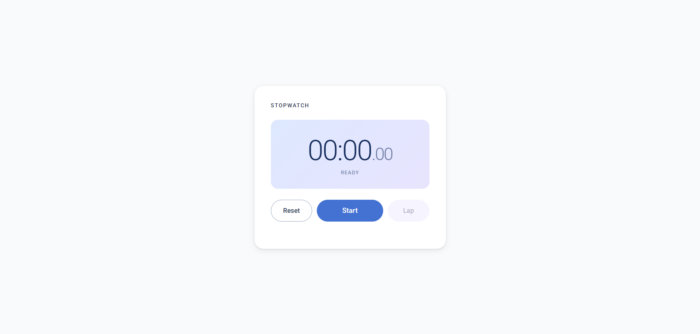

# Stopwatch

> A zero-dependency browser stopwatch — clone it, serve it, done. No npm install. No bundler. No build step.



[](https://johnlester-0369.github.io/web-stopwatch-app)
[](#)
[](#license)

---

## Quick Start

> **Why a local server?** `js/app.js` uses ES modules (`type="module"`). Browsers silently block ES module imports over `file://` — double-clicking `index.html` will not work. Any local HTTP server resolves this.

```bash
git clone https://github.com/johnlester-0369/web-stopwatch-app.git
cd web-stopwatch-app
npx serve .
```

Open **http://localhost:3000** — the stopwatch is ready.

**Alternative servers — pick whichever matches your setup:**

| Method | Command | URL |
|---|---|---|
| Node (`npx serve`) | `npx serve .` | http://localhost:3000 |
| Python 3 | `python3 -m http.server 8080` | http://localhost:8080 |
| VS Code Live Server | Right-click `index.html` → *Open with Live Server* | auto-opens |

Node's `npx serve` requires no install if Node ≥ 16 is already present — it pulls the package on demand.

---

## Features

- **Start / Pause / Resume** — single button cycles through all three states
- **Reset** — returns to zero and clears all laps instantly
- **Lap recording** — with **Best** and **Slow** badges (visible at 2+ laps; single-lap has no comparative reference)
- **Centisecond precision** — `MM:SS.cc` display, wall-clock accurate even when the tab is backgrounded or the browser throttles the interval
- **Responsive** — 320 px phones through desktop; WCAG 2.5.8 touch targets (48 px minimum)
- **Material-inspired UI** — CSS custom property design tokens, gradient display panel, smooth state transitions
- **Zero runtime dependencies** — no npm, no bundler, no build pipeline; the entire app is three JS files and one stylesheet

---

## Project Structure

```
web-stopwatch-app/
├── index.html        # Structure only — no inline JS, no inline CSS
├── css/
│   └── styles.css    # All styling; design tokens via CSS custom properties
└── js/
    ├── app.js        # Composition root — wires timer ↔ UI; owns all event listeners
    ├── timer.js      # Pure timer domain — zero DOM; wall-clock diff prevents interval drift
    └── ui.js         # All DOM mutations — imports only formatTime from timer.js
```

---

## Architecture

**Module dependency graph:**

```
┌────────────────────────────────────────────┐
│                 index.html                 │
│              (browser entry)               │
└──────────────────────┬─────────────────────┘
                       │ ES module
                       ▼
┌────────────────────────────────────────────┐
│                   app.js                   │
│             (composition root)             │
│   onTick · toggleStartStop · handleReset   │
│                  handleLap                 │
└────────┬─────────────────────────┬─────────┘
         │                         │
      import *                  import *
         │                         │
         ▼                         ▼
┌──────────────────┐      ┌──────────────────┐
│    timer.js      │      │      ui.js       │
│  (pure state)    │      │  (DOM mutations) │
│                  │      │                  │
│  getTotal()      │      │  updateDisplay() │
│  isRunning()     │      │  updateButtons() │
│  start()         │      │  updateStatus()  │
│  pause()         │      │  resetDisplay()  │
│  reset()         │      │  renderLaps()    │
│  recordLap()     │      │                  │
│  formatTime()    │      │                  │
└──────────────────┘      └──────────────────┘
         │                         ▲
         └──── formatTime() ───────┘
```

```
index.html
  └── app.js  (composition root)
        ├── timer.js  (state + time logic — no DOM)
        └── ui.js     (DOM mutations — imports formatTime from timer.js only)
```

The three modules enforce a strict one-way dependency direction with a single shared edge (`ui.js → timer.js` for `formatTime` only). Each design decision below trades a small constraint for a larger testability or maintainability gain.

**`timer.js` has zero DOM knowledge.**
The `onTick` callback is injected by `app.js` at call time rather than imported directly. This means `timer.js` can be unit-tested in Node without a browser, `jsdom`, or any mocking layer — the test simply passes its own callback.

**`ui.js` never reads timer state.**
Every value it renders arrives as a function argument from `app.js`. Replacing `timer.js` with a Web Worker–based implementation, a server-synced timer, or a mock requires no changes to `ui.js` — the DOM layer is fully decoupled from the timing logic.

**`app.js` is the only module that knows both `timer` and `ui` exist.**
All orchestration — deciding when to start, pause, record laps, and reset — lives in the composition root. Neither domain module is aware of the other, which keeps the dependency graph acyclic and each module independently swappable.

**Wall-clock diffing, not increment accumulation.**
`timer.js` stores `Date.now()` at start and computes elapsed as `Date.now() - startedAt` on every tick. Accumulating interval increments would cause visible drift when the browser throttles background tab intervals (common on mobile and in power-saving mode). The wall-clock approach self-corrects on every tick regardless of how late the interval fires.

**No bundler — by design.**
Native ES modules + a one-line HTTP server cover every requirement this project has. A bundler would add a build step, a `node_modules` directory, a config file, and a more involved contributor setup. At this scale and with zero external imports, the cost outweighs any benefit.

---

## Tech Stack

| Concern | Technology | Why |
|---|---|---|
| Markup | HTML5 | Structural shell only — no inline scripts or styles keeps separation of concerns clean |
| Styling | CSS3 — custom properties, `clamp()`, Grid | Design tokens allow palette-wide theming from one block; `clamp()` eliminates most breakpoint media queries |
| Logic | Vanilla JavaScript — ES2020 modules | No framework overhead; the module import graph *is* the architecture diagram |
| Font | [Roboto](https://fonts.google.com/specimen/Roboto) via Google Fonts | Weight range 300–700 provides the contrast needed between the large display digits and small label text |
| Hosting | GitHub Pages | Zero-config static hosting; no server, no CI pipeline required for a purely client-side project |

---

## Contributing

The project has no build step, so the contributor setup is the same as the Quick Start above. All source files are plain JS and CSS — no compilation, no transpilation.

Before submitting a pull request:
- Verify the stopwatch functions correctly across Start → Pause → Resume → Lap → Reset flows
- Test on at least one narrow viewport (≤ 400 px) to confirm the responsive layout holds
- Keep `timer.js` DOM-free — it must remain runnable in Node without a browser environment

---

## License

MIT
